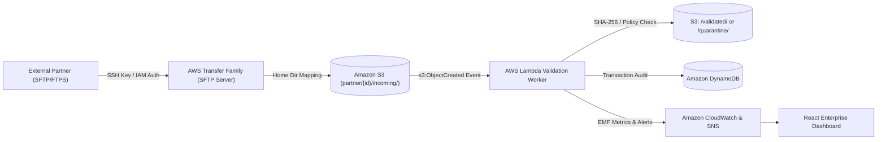
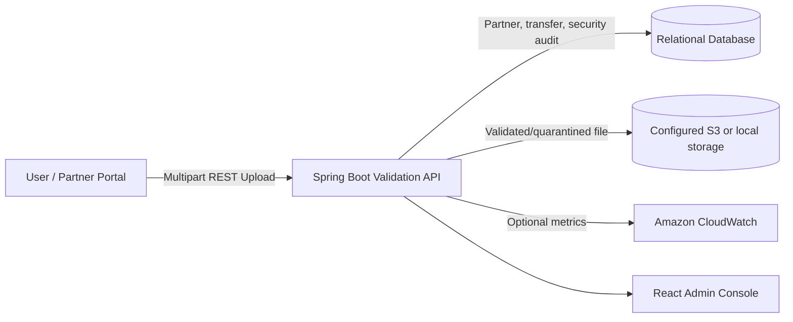

# Secure Partner File Exchange Platform (Enterprise Edition)

[](https://spring.io)
[](https://react.dev)
[](https://aws.amazon.com/s3)
[](https://aws.amazon.com/cloudwatch)

---

## 🏛️ Executive Summary & Architecture Alignment

The application provides a partner directory, user-driven file uploads, backend validation, persistent transfer/security records, and S3 or local file storage. It starts without generated partner, transfer, or audit records.

### Runtime and Optional AWS Integrations
> [!IMPORTANT]
> The application accepts uploads through its REST API. Partners, transfers, and security audit events are stored in the configured relational database (H2 by default); file bytes are stored in the configured S3 bucket or the persistent local storage directory. AWS Transfer Family is not provisioned by the application. The optional infrastructure under `aws-infra/terraform` describes a separate S3/Lambda/DynamoDB/CloudWatch pipeline.

---

## 🔄 Architectural Comparison

### 1. Target Production Architecture (Project PPT Alignment)


### 2. Current Application Runtime


---

## 📁 Amazon S3 Folder Partition Architecture

Stored file keys are partitioned by partner ID and lifecycle state. In AWS mode these are S3 object keys; local mode stores them beneath `backend/data/storage`:

```text
partner/{partnerId}/
├── validated/    # Files accepted by the configured validation policy
├── quarantine/   # Policy violations and duplicate files
└── outgoing/     # Accepted outbound files
```

---

## 🛡️ Enterprise Security & Validation Engine

Every uploaded file undergoes an 8-stage automated inspection pipeline:

1. **Cryptographic SHA-256 Computation:** Computes SHA-256 across the uploaded file bytes.
2. **Partner Access Verification:** Verifies partner existence and ensures account is `ACTIVE`. Suspended accounts are immediately quarantined.
3. **Path Traversal & Null Byte Sanitization:** Blocks `../`, `..\\`, directory traversal, and null byte injections.
4. **Prohibited Executable / Script Blacklist:** Intercepts dangerous file formats (`.exe`, `.bat`, `.cmd`, `.sh`, `.vbs`, `.scr`, `.dll`, `.ps1`, `.jar`, `.app`).
5. **Partner File Type Whitelist:** Confirms extension matches partner contract (e.g. `.csv`, `.json`, `.xml`, `.pdf`, `.pgp`).
6. **Partner SLA Quota Verification:** Enforces the partner's configured maximum file size.
7. **SHA-256 Duplicate Check:** Checks persisted transfer records for prior instances of the same payload. If a duplicate is found, the file is tagged `DUPLICATE` and quarantined.
8. **Persistent Storage:** Accepted uploads are stored under the appropriate partner prefix, and transfer/security results are recorded in the relational database.

---

## 🚀 Quick Start & Local Execution

### Prerequisites
- Java 21
- Node.js v20+ and npm

### 1. Run Spring Boot Backend
Open a terminal in `backend/`:
```powershell
Set-Location "<project-root>\backend"
.\mvnw.cmd spring-boot:run
```
*Or execute the pre-packaged JAR directly:*
```powershell
java -jar target\secure-partner-file-exchange-1.0.0.jar
```
Backend starts on **http://localhost:8080** with no generated records. Partner records are persisted in the local H2 database (`backend/data/partnersdb`) and can be created from the Partners page or through the REST API. Upload files from the File Exchange page after registering a partner. Local file bytes persist under `backend/data/storage`; set `S3_BUCKET_NAME` and AWS credentials to use S3 instead.

Partner endpoints are available at `/api/partners`: `GET` lists records, `GET /{partnerId}` returns a record, `POST` creates a record, and `PATCH /{partnerId}/status` changes its status. Dashboard partner totals are derived from these database records.

### 2. Run React Frontend
In a separate terminal:
```powershell
Set-Location "<project-root>\frontend"
npm.cmd run dev
```
Frontend launches at **http://localhost:5173** and connects to the Spring Boot REST backend via Vite proxy.

---

## User-Driven Workflows

Register partners using the Partners form, then upload a file you select through the File Exchange page. The dashboard, storage browser, transfer history, and security views are populated only from persisted partner/transfer/audit records and files; empty states are shown when those sources contain no records.

---

## 📜 Repository Structure

```text
secure-file-exchange/
├── backend/                               # Spring Boot 3.3.4 Application
│   ├── mvnw.cmd                           # Portable Maven wrapper
│   ├── pom.xml                            # AWS SDK v2 + Spring Boot dependencies
│   └── src/main/java/com/aws/partner/fileexchange/
│       ├── config/                        # AWS Credentials & CORS Configuration
│       ├── controller/                    # REST APIs (Dashboard, Partners, Files, Security)
│       ├── model/                         # Domain Entities (Partner, Transfer, SecurityEvent)
│       ├── repository/                    # Spring Data JPA repositories
│       └── service/                       # FileValidationService, StorageService, CloudWatch
├── frontend/                              # React 18 + Tailwind CSS + Lucide + Recharts
│   ├── src/components/
│   │   ├── Navbar.jsx                     # AWS Status & Cloud Region indicator
│   │   ├── Sidebar.jsx                    # Console navigation with partition badge
│   │   ├── TransferFamilyNoticeBanner.jsx # Runtime and optional AWS integration notice
│   │   ├── DashboardView.jsx              # Executive KPI cards, area throughput & donut charts
│   │   ├── PartnersView.jsx               # Partner directory, quota manager, suspend/activate
│   │   ├── FileUploadView.jsx             # User-selected file upload
│   │   ├── S3ExplorerView.jsx             # Visual S3 bucket partition browser & download
│   │   ├── TransferHistoryView.jsx        # Persisted transaction history
│   │   ├── SecurityView.jsx               # Threat forensics, incident resolver, quarantine purge
│   │   ├── ArchitectureView.jsx           # Interactive architecture diagram & IaC code viewer
│   │   └── CloudWatchLogsWidget.jsx       # Backend activity and optional metrics
│   └── src/services/api.js                # Centralized REST client
└── aws-infra/                             # Production Infrastructure-as-Code
    ├── cloudformation/template.yml        # Full CloudFormation stack with Transfer Family & S3
    ├── terraform/main.tf                  # Terraform HCL definitions for AWS production
    └── lambda/lambda_function.py          # Production Python 3.11 Lambda validation function
```
