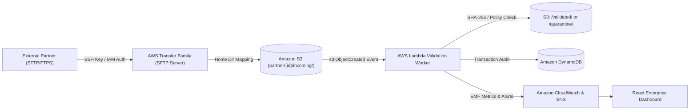
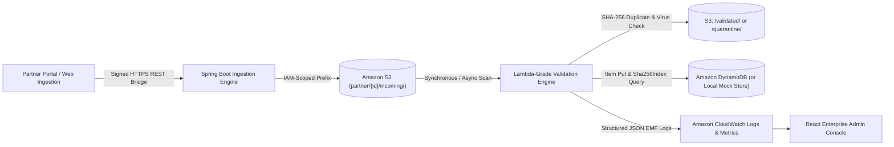

# Secure Partner File Exchange Platform (Enterprise Edition)

[](https://spring.io)
[](https://react.dev)
[](https://aws.amazon.com/s3)
[](https://aws.amazon.com/dynamodb)
[](https://aws.amazon.com/cloudwatch)

---

## 🏛️ Executive Summary & Architecture Alignment

This platform demonstrates the end-to-end production concept of an **Enterprise Secure Partner File Exchange Platform**, built strictly to satisfy real-world security standards and AWS cloud best practices.

### ⚠️ Important AWS Learner Lab Constraint & Transparency Notice
> [!IMPORTANT]
> **AWS Transfer Family Constraint:** In student and academic **AWS Learner Lab** accounts, AWS Transfer Family SFTP server endpoints cannot be provisioned due to IAM boundary limitations, VPC endpoint constraints, and service quotas.
> 
> To maintain absolute academic and professional integrity:
> - **We DO NOT fake or mock a synthetic Transfer Family endpoint.**
> - **AWS Transfer Family is explicitly designated as the Planned Production Integration.**
> - The live system implements the identical end-to-end validation pipeline using direct S3 partitioned ingestion, automated Lambda-grade validation logic, DynamoDB transaction audit cataloging, and CloudWatch Embedded Metric Format (EMF) logging.

---

## 🔄 Architectural Comparison

### 1. Target Production Architecture (Project PPT Alignment)


### 2. Active Achieved AWS Learner Lab Implementation


---

## 📁 Amazon S3 Folder Partition Architecture

Storage is strictly partitioned on Amazon S3 by partner ID and lifecycle state:

```text
s3://secure-partner-file-exchange-lab/
└── partner/
    ├── PRT-HEALTHCORP/
    │   ├── incoming/     # Drop zone for fresh partner payloads
    │   ├── validated/    # Clean, sanitized files with verified SHA-256
    │   ├── quarantine/   # Isolated malware, prohibited extensions, or duplicate files
    │   └── outgoing/     # Staged files for outbound partner delivery
    ├── PRT-FINTECH-GLOBAL/
    ├── PRT-LOGIX-SUPPLY/
    └── PRT-APEX-RETAIL/
```

---

## 🛡️ Enterprise Security & Validation Engine

Every uploaded file undergoes an 8-stage automated inspection pipeline:

1. **Cryptographic SHA-256 Computation:** Computes SHA-256 hash across the streaming byte payload.
2. **Partner Access Verification:** Verifies partner existence and ensures account is `ACTIVE`. Suspended accounts are immediately quarantined.
3. **Path Traversal & Null Byte Sanitization:** Blocks `../`, `..\\`, directory traversal, and null byte injections.
4. **Prohibited Executable / Script Blacklist:** Intercepts dangerous file formats (`.exe`, `.bat`, `.cmd`, `.sh`, `.vbs`, `.scr`, `.dll`, `.ps1`, `.jar`, `.app`).
5. **Partner File Type Whitelist:** Confirms extension matches partner contract (e.g. `.csv`, `.json`, `.xml`, `.pdf`, `.pgp`).
6. **Partner SLA Quota Verification:** Enforces maximum file size limit (e.g., 25MB).
7. **SHA-256 Duplicate Collision Filter:** Queries DynamoDB `Sha256Index` for prior instances of the same payload. If a collision is found, the file is tagged `DUPLICATE` and quarantined.
8. **Automated Partition Relocation:** Clean payloads are moved to `partner/{id}/validated/`. Violations are isolated to `partner/{id}/quarantine/`.

---

## 🚀 Quick Start & Local Execution

### Prerequisites
- Java 21 or Java 26 (Runtime already configured on this system)
- Node.js v20+ and npm

### 1. Run Spring Boot Backend
Open a terminal in `backend/`:
```powershell
cd C:\Users\ASUS\.gemini\antigravity\scratch\secure-file-exchange\backend
.\mvnw.cmd spring-boot:run
```
*Or execute the pre-packaged JAR directly:*
```powershell
java -jar target\secure-partner-file-exchange-1.0.0.jar
```
Backend starts on **http://localhost:8080** with seeded demo partners, transactions, and S3 objects.

### 2. Run React Frontend
In a separate terminal:
```powershell
cd C:\Users\ASUS\.gemini\antigravity\scratch\secure-file-exchange\frontend
npm.cmd run dev
```
Frontend launches at **http://localhost:5173** and connects to the Spring Boot REST backend via Vite proxy.

---

## 🎯 Live Presentation Demo Scenarios

The web interface includes an interactive **1-Click Test Matrix** in the *File Exchange* tab:

| Scenario | Trigger Button | What Happens |
| :--- | :--- | :--- |
| **Valid Claims Batch** | `+ Valid CSV` | Generates EDI healthcare claims. Validates MIME, size, SHA-256, and places in S3 `/validated/`. |
| **Malware Injection** | `+ Malware .exe` | Generates a binary with PE header and `.exe` extension. Automatically blocked and isolated to `/quarantine/` with a CRITICAL alert. |
| **Duplicate Detection** | `+ Duplicate` | Re-transmits an existing claims batch. DynamoDB SHA-256 index catches duplicate hash, flags `DUPLICATE` status. |
| **Suspended Partner** | Scenario 4 | Attempts upload for `PRT-APEX-RETAIL` (on compliance hold). Request is rejected. |
| **Encrypted EDI** | `+ Encrypted PGP` | Processes PGP-armored financial settlement payload for `PRT-FINTECH-GLOBAL`. |

---

## 📜 Repository Structure

```text
secure-file-exchange/
├── backend/                               # Spring Boot 3.3.4 Application
│   ├── mvnw.cmd                           # Portable Maven wrapper
│   ├── pom.xml                            # AWS SDK v2 + Spring Boot dependencies
│   └── src/main/java/com/aws/partner/fileexchange/
│       ├── config/                        # AWS Credentials & CORS Configuration
│       ├── controller/                    # REST APIs (Dashboard, Partners, Files, Security)
│       ├── model/                         # Domain Entities (Partner, Transfer, SecurityEvent)
│       ├── repository/                    # DynamoDB + In-Memory Synchronized Stores
│       └── service/                       # FileValidationService, StorageService, CloudWatch
├── frontend/                              # React 18 + Tailwind CSS + Lucide + Recharts
│   ├── src/components/
│   │   ├── Navbar.jsx                     # AWS Status & Cloud Region indicator
│   │   ├── Sidebar.jsx                    # Console navigation with partition badge
│   │   ├── TransferFamilyNoticeBanner.jsx # Transparent Learner Lab constraint advisory
│   │   ├── DashboardView.jsx              # Executive KPI cards, area throughput & donut charts
│   │   ├── PartnersView.jsx               # Partner directory, quota manager, suspend/activate
│   │   ├── FileUploadView.jsx             # Drag-and-drop exchange & 1-click demo test matrix
│   │   ├── S3ExplorerView.jsx             # Visual S3 bucket partition browser & download
│   │   ├── TransferHistoryView.jsx        # Complete DynamoDB transaction audit catalog
│   │   ├── SecurityView.jsx               # Threat forensics, incident resolver, quarantine purge
│   │   ├── ArchitectureView.jsx           # Interactive architecture diagram & IaC code viewer
│   │   └── CloudWatchLogsWidget.jsx       # Real-time CloudWatch EMF log stream drawer
│   └── src/services/api.js                # Centralized REST client
└── aws-infra/                             # Production Infrastructure-as-Code
    ├── cloudformation/template.yml        # Full CloudFormation stack with Transfer Family & S3
    ├── terraform/main.tf                  # Terraform HCL definitions for AWS production
    └── lambda/lambda_function.py          # Production Python 3.11 Lambda validation function
```
